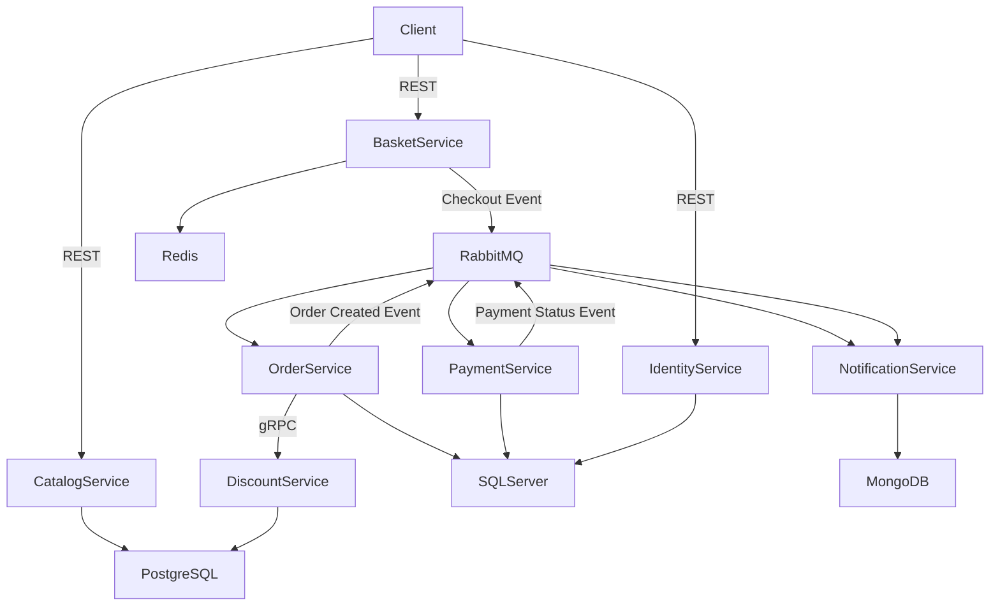

# 🛒 E-Commerce Microservices Architecture (.NET 9)

This repository contains a **cloud-native, scalable e-commerce application** built using **Microservices Architecture** with **.NET 9**, following modern distributed system patterns such as **event-driven communication, gRPC, outbox & saga pattern, CI/CD automation, and container orchestration**.

The system is designed for **high availability, performance, and extensibility**, and is fully containerized and deployed to **Microsoft Azure using Docker, Kubernetes, and automated CI/CD pipelines**.

---

## 🧩 Architecture Overview

The platform consists of **7 independent microservices**, each owning its own database and communicating through **REST, gRPC, and asynchronous messaging (RabbitMQ)**.

Key architectural principles:

* **Database per service**
* **Event-driven architecture**
* **Synchronous (gRPC) + Asynchronous (RabbitMQ) communication**
* **Outbox pattern for reliable messaging**
* **Containerized deployment (Docker & Kubernetes)**
* **Automated CI/CD with Azure DevOps / GitHub Actions**

---

## 🏗️ Microservices Breakdown

### 1️⃣ Catalog Service

**Purpose:** Manages product catalog, categories, and pricing information.

* **Tech Stack:**

  * .NET 9
  * PostgreSQL
  * Entity Framework Core
* **Responsibilities:**

  * Product CRUD operations
  * Category management
  * Product search & filtering

---

### 2️⃣ Discount Service

**Purpose:** Provides discount and promotion data for products.

* **Tech Stack:**

  * .NET 9
  * PostgreSQL
  * Dapper
* **Responsibilities:**

  * Discount rules management
  * High-performance discount queries
* **Communication:**

  * gRPC (consumed by Order Service)

---

### 3️⃣ Basket Service

**Purpose:** Handles user shopping cart operations.

* **Tech Stack:**

  * .NET 9
  * Redis
* **Responsibilities:**

  * Add/update/remove cart items
  * Temporary cart persistence
* **Events:**

  * Publishes **Checkout Event** to RabbitMQ when checkout is initiated

---

### 4️⃣ Order Service

**Purpose:** Core order processing and orchestration service.

* **Tech Stack:**

  * .NET 9
  * SQL Server
  * gRPC Client
  * Hangfire (Background Jobs)
* **Responsibilities:**

  * Order creation & management
  * Calls **Discount Service via gRPC**
  * Implements **Outbox Pattern** for reliable event publishing
* **Events Published:**

  * Order Created → Payment Service
  * Order Created → Notification Service

---

### 5️⃣ Payment Service

**Purpose:** Handles payment processing and payment lifecycle.

* **Tech Stack:**

  * .NET 9
  * SQL Server
  * Entity Framework Core
* **Responsibilities:**

  * Consumes order events
  * Processes payments via external payment APIs
  * Publishes payment success/failure events

---

### 6️⃣ Notification Service

**Purpose:** Sends user notifications related to order and payment status.

* **Tech Stack:**

  * .NET 9
  * MongoDB
  * Entity Framework Core
* **Responsibilities:**

  * Consumes order placed and payment status events
  * Sends email / SMS / push notifications

---

### 7️⃣ Identity Service

**Purpose:** Centralized authentication and authorization service.

* **Tech Stack:**

  * .NET 9
  * SQL Server
  * Entity Framework Core
* **Responsibilities:**

  * User authentication
  * JWT token issuance
  * Role-based access control

---

## 🔄 Communication Patterns

* **REST APIs** – External client communication
* **gRPC** – High-performance synchronous service-to-service calls
* **RabbitMQ** – Asynchronous event-driven communication
* **Hangfire** – Background job processing
* **Outbox Pattern** – Guaranteed message delivery

---

## 📦 Infrastructure & DevOps

* **Containerization:** Docker
* **Orchestration:** Kubernetes
* **CI/CD:** Azure DevOps / GitHub Actions
* **Cloud Platform:** Microsoft Azure
* **Caching:** Redis
* **Message Broker:** RabbitMQ

---

## 🗺️ System Architecture Diagram

---

## 🚀 Deployment Flow

1. Code pushed to GitHub repository
2. CI pipeline builds and tests services
3. Docker images are created and pushed to container registry
4. CD pipeline deploys services to Azure Kubernetes Service (AKS)
5. Services communicate internally via Kubernetes networking

---

## ✅ Key Highlights

* Fully **event-driven microservices architecture**
* **High-performance gRPC communication**
* **Resilient messaging with outbox pattern**
* **Scalable containerized deployment**
* **Production-ready enterprise design**

